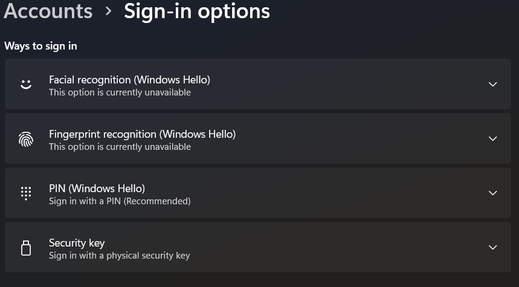

# Scenario 1: User Cannot Sign In

## Problem

A user reported that they were unable to sign into their Windows account.

## Troubleshooting Steps

1. Verified that the username was entered correctly.
2. Confirmed that Caps Lock was not enabled and that the keyboard was functioning properly.
3. Reviewed account information in Windows Settings.
4. Reviewed available sign-in options.
5. Simulated a password reset after verifying the user's identity.
6. Confirmed that the user was able to successfully sign into Windows.

## Resolution

The user's password was reset, and they were able to successfully access their account.

## What I Learned

Login issues are often caused by simple problems such as incorrect credentials, keyboard input errors, or forgotten passwords. Verifying account information before performing a password reset helps ensure the correct account is being serviced.

## Evidence

