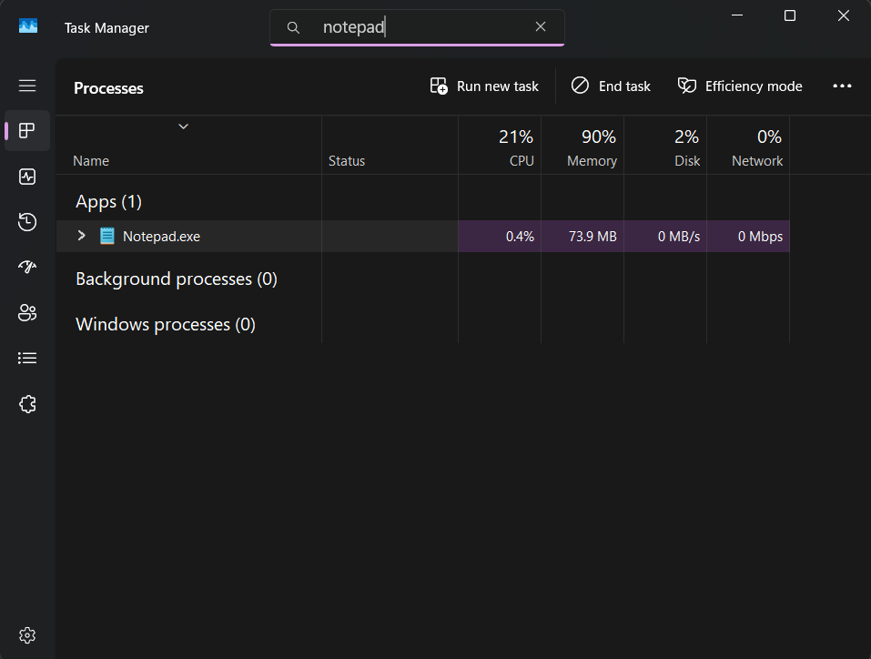

# Scenario 1: Application Would Not Open

## Problem

A user reported that Notepad was not opening correctly.

## Troubleshooting Steps

1. Opened Task Manager to determine if Notepad was already running.
2. Searched for the Notepad process.
3. Found Notepad.exe running in the background.
4. Ended the existing process and relaunched the application.

## Resolution

After ending the existing Notepad process, the application opened successfully.

## What I Learned

Applications may fail to launch if an existing process becomes stuck in memory.

## Evidence

