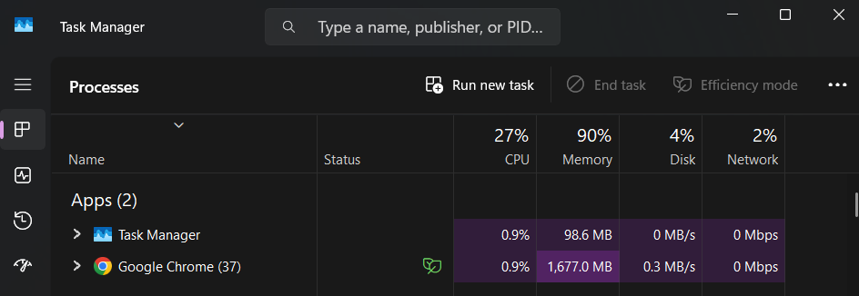
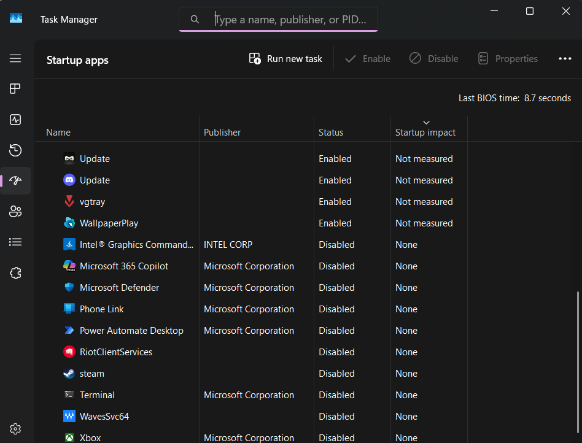

# Scenario 5: Computer Running Slow

## Problem

A user reported that their computer was running slower than usual.

## Troubleshooting Steps

1. Opened Task Manager to review system resource usage.
2. Observed memory utilization reaching approximately 90%.
3. Reviewed running applications and background processes.
4. Opened Startup Apps to identify unnecessary programs launching at startup.
5. Identified several applications configured to start automatically.

## Resolution

Reviewed startup applications and identified programs that could be disabled to improve performance.

## What I Learned

High memory utilization and excessive startup applications can negatively impact overall system performance.

## Evidence

