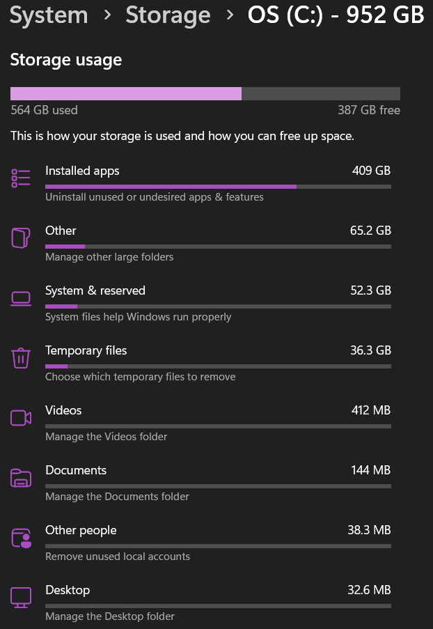
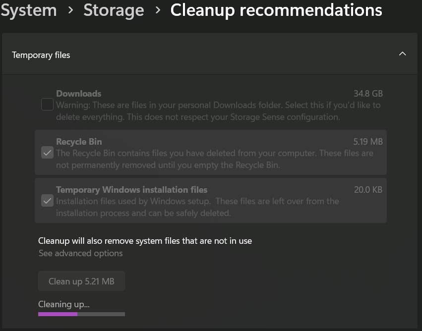

# Scenario 6: Full Disk Space

## Problem

A user reported receiving low storage warnings and noticed their computer was running slower than normal.

## Troubleshooting Steps

1. Opened Settings and navigated to System > Storage.
2. Reviewed storage usage to identify what was taking up the most disk space.
3. Found temporary files and other unnecessary files using a significant amount of storage.
4. Opened Disk Cleanup to remove unnecessary files.
5. Selected temporary files and other items that were safe to remove.
6. Ran Disk Cleanup and verified that storage space was recovered.

## Resolution

Removed unnecessary files using Disk Cleanup, which freed up disk space and improved overall system performance.

## What I Learned

Low disk space can impact system performance. Windows tools like Storage Settings and Disk Cleanup make it easy to identify and remove unnecessary files.

## Evidence

