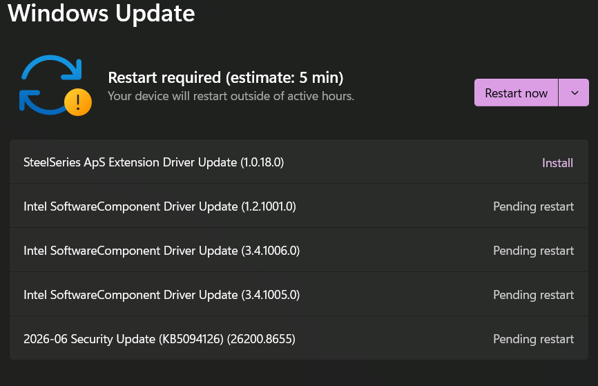
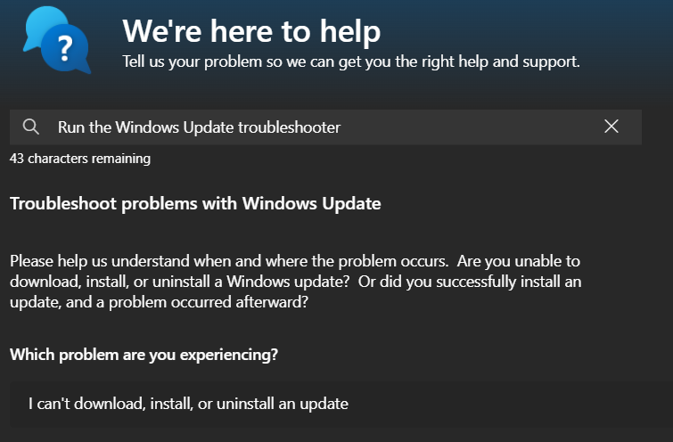
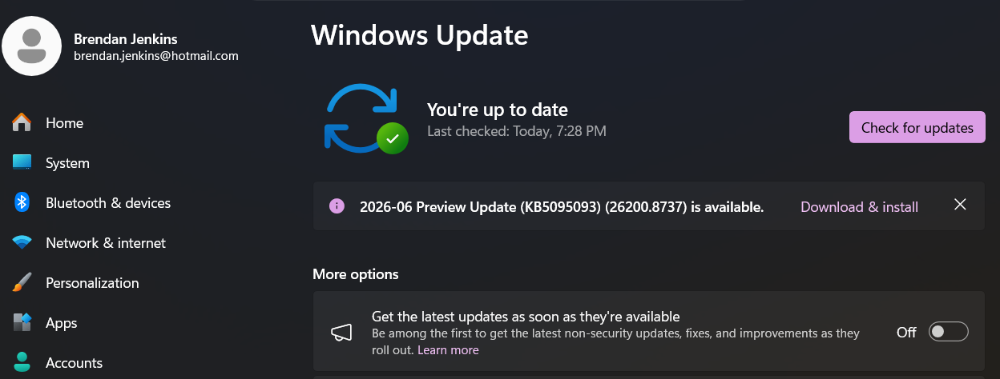

# Scenario 7: Windows Update Troubleshooting

## Problem

A user reported issues with Windows updates and wanted to verify that the system was receiving updates correctly.

## Troubleshooting Steps

1. Opened Windows Update settings.
2. Checked the current update status and searched for available updates.
3. Verified that Windows was able to check for updates successfully.
4. Opened the Windows Update Troubleshooter.
5. Ran the troubleshooter to check for common update-related issues.
6. Reviewed the results and confirmed that no major issues were detected.

## Resolution

Verified that Windows Update was functioning correctly and confirmed that the system was able to check for and receive updates.

## What I Learned

Windows Update and the built-in troubleshooter are useful tools for identifying and resolving common update issues.

## Evidence

